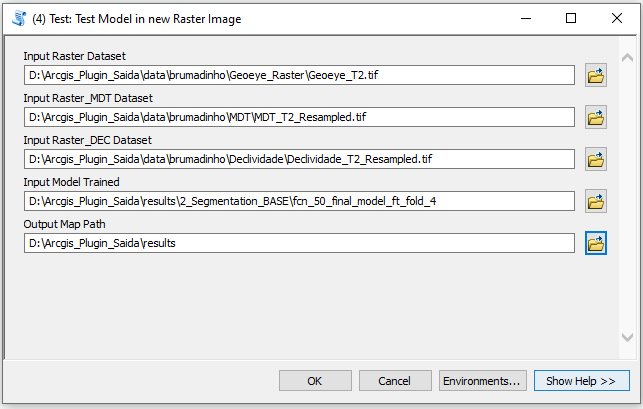
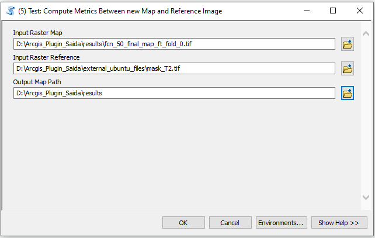

<!-- PROJECT SHIELDS -->
<!--
*** I'm using markdown "reference style" links for readability.
*** Reference links are enclosed in brackets [ ] instead of parentheses ( ).
*** See the bottom of this document for the declaration of the reference variables
*** for contributors-url, forks-url, etc. This is an optional, concise syntax you may use.
*** https://www.markdownguide.org/basic-syntax/#reference-style-links
-->
<!--
[![Contributors][contributors-shield]][contributors-url]
[![Forks][forks-shield]][forks-url]
[![Stargazers][stars-shield]][stars-url]
[![Issues][issues-shield]][issues-url]
[![MIT License][license-shield]][license-url]
[![LinkedIn][linkedin-shield]][linkedin-url]
-->

## [ArcGIS Plugin] Deep Learning Framework in Brumadinho Area
<!-- PROJECT LOGO -->
<br />
<p align="center">
  <a href="https://github.com/othneildrew/Best-README-Template">
    
  </a>
</p>

<!-- TABLE OF CONTENTS -->
## Table of Contents

* [About the Project](#about-the-project)
  * [Built With](#built-with)
* [Getting Started](#getting-started)
  * [Prerequisites](#prerequisites)
  * [Installation](#installation)
* [Usage](#usage)
* [Contact](#contact)
* [Acknowledgements](#acknowledgements)


<!-- ABOUT THE PROJECT -->
## About The Project

[![Product Name Screen Shot][product-screenshot]](https://example.com)

Este módulo do projeto consiste em desenvolver um sistema automático baseado em aprendizado profundo para identificar, mapear e quantificar as áreas impactadas pelo desastre, a partir da classificação supervisionada de imagens de alta resolução espacial, utilizando processamento digital de imagens na sub-bacia do Ribeirão Ferro Carvão, em três momentos:

* T1: antes do rompimento (entre dezembro de 2018 e 25 jan 2019)

* T2: imediatamente após o rompimento (após 25/jan/2019 até 01 fev 2019)

* T3: atual (dez/2019 a fev/2020);

Para isso, definiu-se uma abordagem de segmentação semântica, baseada nas arquiteturas de redes neurais Deeplab-V3 [1] e Fully Convolutional Network (FCN) [2]. Foi utilizado um dataset construído com imagens do satélite GeoEye, imagens do Modelo Digital de Terreno (MDT) e a Declividade do Terreno (DEC) nos momentos T1, T2 e T3. Tal dataset contém um subconjunto de amostras que foram rotuladas manualmente usando as imagens no tempo T3. Essas amostras são utilizadas como dado de referência para o treinamento do aprendizado supervisionado, enquanto as imagens no tempo T2 e T1 compõem o conjunto de dados de teste.


<!-- GETTING STARTED -->
## Getting Started

### Pré-requisitos

1. Baixe e instale o Anaconda para Windows (https://www.anaconda.com/products/individual#windows)
2. Crie um novo ambient virtual para python 3.8, com o nome 'arc105' (evitaremos o ambiente base, pois contém muitos bibliotecas desnecessarias)
3. Dentro do Anaconda Power shell, mude para o novo ambiente criado digitando:

```sh
> conda activate 105
```

e em seguida instale as bibliotecas do pytorch digitando:

```sh
> conda install pytorch torchvision cudatoolkit=10.2 -c pytorch
```

4. Existem outros dependencias que precisam ser instaladas. Para isso, dentro do ambiente do anaconda search e instale as seguintes bibliotecas:

```sh
> rasterio
> shapely
> pyshp
> scikit-image
> tensorboard
> scikit-learn
> tqdm
> imgaug
```

### Instalação do Plugin

1. Clone/Baixe o repositorio
```sh
git clone https://github.com/edemir-matcomp/brumadinho_arcgis_plugin
```
2. A instalação do plugin é bastante fácil. A única etapa necessária é copiar este repositório para a pasta em que o ArcGis está instalado. Normalmente, ele pode ser encontrado em C:\Users\Username\Documents\ArcGIS. Em seguida, abra o software ArcGIS e você poderá visualizar o plugin na barra da direita, como pode ser visto na figura abaixo. 
```sh
npm install
```

<!-- USAGE EXAMPLES -->
## Exemplo de Uso

Uso para Teste:

Caso queira apenas utilizar um modelo já treinado e gerar um novo mapa de predição, iremos utilizar os scripts de Teste:
* (4) Test: Test Model in new Raster Image
* (5) Test: Compute Metrics Between new Map and Reference Image

A imagem abaixo mostra um exemplo de utilização de (4) usando um modelo treinado em T3 aplicado para a imagem no tempo T2:

<br />
<p align="center">
    
</p>

A imagem abaixo mostra um exemplo de utilização de (5) usando um mapa gerado em (4) para comparar com a sua mascara de referencia:

<br />
<p align="center">
    
</p>

<!-- CONTACT -->
## Contact

Edemir Ferreira de Andrade Junior - edemir.matcomp@gmail.com

Project Link: [https://github.com/edemir-matcomp/brumadinho_arcgis_plugin](https://github.com/edemir-matcomp/brumadinho_arcgis_plugin)


<!-- ACKNOWLEDGEMENTS -->
## Acknowledgements
* [GitHub Emoji Cheat Sheet](https://www.webpagefx.com/tools/emoji-cheat-sheet)
* [Img Shields](https://shields.io)


<!-- MARKDOWN LINKS & IMAGES -->
<!-- https://www.markdownguide.org/basic-syntax/#reference-style-links -->
[contributors-shield]: https://img.shields.io/github/contributors/othneildrew/Best-README-Template.svg?style=flat-square
[contributors-url]: https://github.com/othneildrew/Best-README-Template/graphs/contributors
[forks-shield]: https://img.shields.io/github/forks/othneildrew/Best-README-Template.svg?style=flat-square
[forks-url]: https://github.com/othneildrew/Best-README-Template/network/members
[stars-shield]: https://img.shields.io/github/stars/othneildrew/Best-README-Template.svg?style=flat-square
[stars-url]: https://github.com/othneildrew/Best-README-Template/stargazers
[issues-shield]: https://img.shields.io/github/issues/othneildrew/Best-README-Template.svg?style=flat-square
[issues-url]: https://github.com/othneildrew/Best-README-Template/issues
[license-shield]: https://img.shields.io/github/license/othneildrew/Best-README-Template.svg?style=flat-square
[license-url]: https://github.com/othneildrew/Best-README-Template/blob/master/LICENSE.txt
[linkedin-shield]: https://img.shields.io/badge/-LinkedIn-black.svg?style=flat-square&logo=linkedin&colorB=555
[linkedin-url]: https://linkedin.com/in/othneildrew
[product-screenshot]: images/screenshot.png
